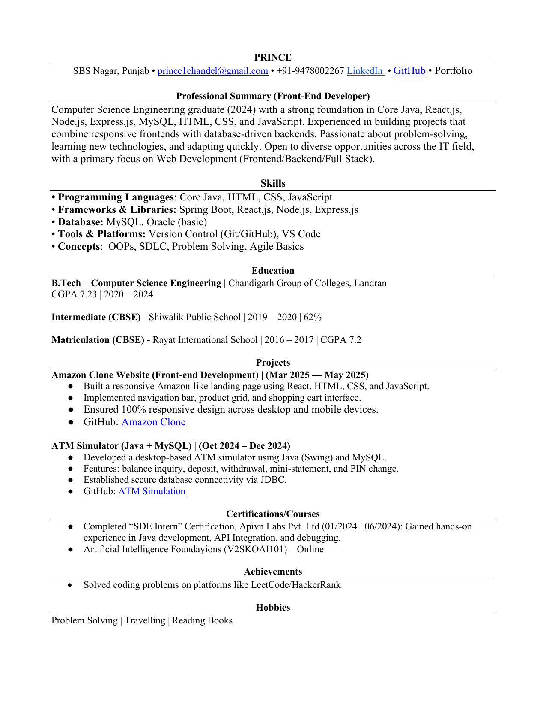

<<<<<<< HEAD
# Prince Portfolio v3

Dark/Light mode, Photo, Scroll Animations (Framer Motion), Projects with images, Hobbies, Resume download.

## Run
```bash
npm install
npm run dev
```
=======
# 🌐 Prince Chandel - Portfolio

This is my personal portfolio website built with **React.js**, **Tailwind CSS**, and **Framer Motion**.  
It showcases my **skills, projects, education, resume, and hobbies** in a clean and modern design.  

🔗 **Live Demo:** [Coming Soon after Deployment]  

---

## 🚀 Tech Stack
- **Frontend:** React.js, Tailwind CSS, Framer Motion  
- **Backend:** Node.js, Express.js (for future integration)  
- **Database:** MySQL  
- **Deployment:** Vercel / Netlify  

---

## 📂 Features
✅ Responsive Design – works on mobile, tablet, and desktop  
✅ Dark / Light Mode toggle with persistence  
✅ Smooth animations & transitions (Framer Motion)  
✅ Project showcase with detailed modal popups  
✅ Downloadable Resume  
✅ Contact section with social links  

---

## 📸 Preview
  

---

## 📌 Sections
- **Hero** – Introduction & social links  
- **About Me** – Short bio and skills overview  
- **Skills** – Core Java, React, Node, Express, MySQL, etc.  
- **Projects** – With live details, GitHub links, and modal preview  
- **Education** – Academic background  
- **Resume** – Downloadable ATS-friendly resume  
- **Hobbies** – Personal interests  
- **Contact** – Email & social handles  

---

## ⚡ Getting Started (For Developers)
1. Clone the repo:
   ```bash
   git clone https://github.com/your-username/prince-portfolio.git
   cd prince-portfolio
>>>>>>> b8e2cf99eebe73b5dac0af067262c77fbcefc73f
